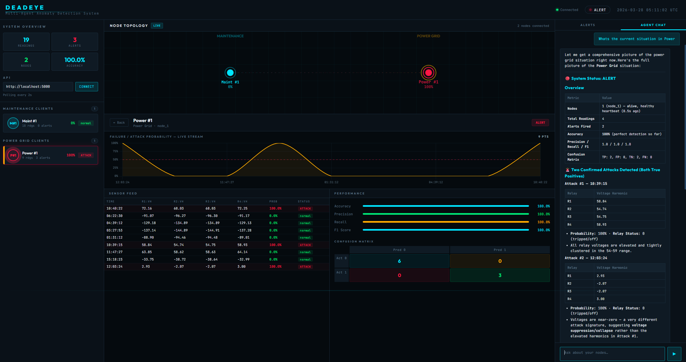
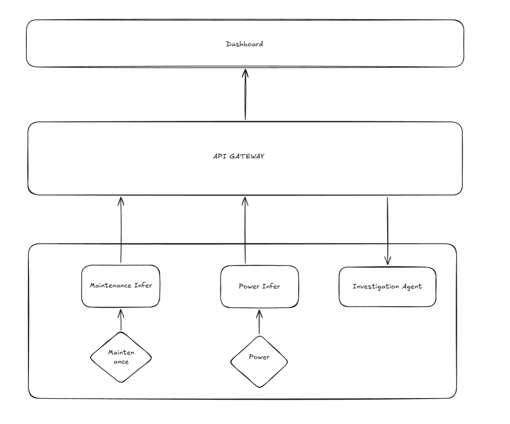

# Deadeye

### Deadeye is a multi-agent system for anomaly detection and predictive maintenance for Industrial control systems

Critical infrastructure and industrial systems — such as energy grids, water treatment plants, transportation networks, and manufacturing facilities — generate massive streams of operational and sensor data every second. Ensuring reliability, resilience, and security in these complex environments is challenging: traditional monitoring methods are largely reactive, addressing problems only after they occur, which can lead to costly downtime, safety risks, and operational inefficiencies.

Deadeye tackles this with a system of **ML inference clients** and an **LLM investigation agent** working in concert: inference clients continuously stream and classify sensor data across two industrial domains, while the investigation agent provides deep, explainable reasoning over the collected evidence — all surfaced through a live operational dashboard.

---



## Table of Contents

- [Overview](#overview)
- [Architecture](#architecture)
- [Components](#components)
  - [Maintenance Client](#maintenance-client)
  - [Power Client](#power-client)
  - [Investigation Agent](#investigation-agent)
- [Datasets](#datasets)
- [Project Structure](#project-structure)
- [Setup & Installation](#setup--installation)
- [Training the Models](#training-the-models)
- [Running the System](#running-the-system)
- [API Reference](#api-reference)
- [Dashboard](#dashboard)
- [Configuration](#configuration)

---

## Overview

Deadeye addresses four key challenges in industrial AI monitoring:

- **Real-time anomaly detection** — Identifying unusual patterns in sensor or operational data, including potential cyber-physical threats
- **Predictive insights** — Anticipating equipment degradation, system failures, or cascading impacts before they occur
- **Decision support and explainability** — Providing actionable, understandable insights to help human operators respond effectively
- **Adaptive and collaborative intelligence** — Leveraging multi-agent coordination to monitor, predict, and act across interconnected systems

---

## Architecture



Multiple inference clients of each type can connect simultaneously. Each registers with the API server and is assigned a unique `node_id`. The investigation agent is embedded inside the API process and shares direct in-memory access to all node data — no extra HTTP hops.

---

## Setup & Installation

**Requirements:** Python 3.10+

```bash
# 1. Clone the repository
git clone https://github.com/your-org/deadeye.git
cd deadeye

# 2. Create a virtual environment
python3 -m venv .venv
source .venv/bin/activate   # Windows: .venv\Scripts\activate

# 3. Install dependencies
pip install flask flask-cors numpy pandas scikit-learn requests \
            langchain langchain-openai langgraph httpx

# 4. Set environment variables
export API_BASE_URL="http://127.0.0.1:5000"   # optional, this is the default
```

---

## Training the Models

Train both models before running inference. This only needs to be done once.

**Maintenance model (Random Forest):**
```bash
python train_maintenance.py --data ai4i2020.csv
# Options:
#   --interval 5          seconds between simulated readings (default: 5)
#   --test-size 0.2       train/test split fraction (default: 0.2)
#   --output model.pkl    output path (default: model.pkl)
#   --no-save             evaluate only, don't save
```

**Power model (Extra Trees):**
```bash
python train_power.py --data ./binaryAllNaturalPlusNormalVsAttacks/
# Options:
#   --interval 1          seconds between simulated PMU readings (default: 1)
#   --test-size 0.2       train/test split fraction (default: 0.2)
#   --output power_model.pkl
#   --no-save
```

Both scripts print a full evaluation report (accuracy, precision, recall, F1, MCC, ROC-AUC, confusion matrix) and feature importance rankings.

---

## Components

### Maintenance Client

**File:** `inference_maintenance.py`  
**Model:** `model.pkl` (Random Forest Classifier)  
**Dataset:** AI4I 2020 Predictive Maintenance Dataset

Streams simulated CNC milling machine sensor readings and classifies each reading as a machine failure or normal operation. Sensor features include:

| Feature | Description |
|---|---|
| Air temperature [K] | Ambient air temperature |
| Process temperature [K] | Process/coolant temperature |
| Rotational speed [rpm] | Spindle rotational speed |
| Torque [Nm] | Applied torque |
| Tool wear [min] | Cumulative tool usage time |

Each reading is timestamped and pushed to the API server, contributing to rolling accuracy, precision, recall, and F1 metrics per node.

**Usage:**
```bash
python inference_maintenance.py --model model.pkl --data ai4i2020.csv
python inference_maintenance.py --model model.pkl --data ai4i2020.csv --speed 5
python inference_maintenance.py --model model.pkl --data ai4i2020.csv --speed 5 --threshold 0.3
python inference_maintenance.py --model model.pkl --data ai4i2020.csv --speed 5 --api-url http://localhost:5000
```

---

### Power Client

**File:** `inference_power.py`  
**Model:** `power_model.pkl` (Extra Trees Classifier)  
**Dataset:** MSU/ORNL Power System Attack Dataset

Streams simulated PMU (Phasor Measurement Unit) readings from a 4-relay power grid and detects cyber-physical attacks. The grid configuration includes:

- **Generators:** G1, G2
- **Intelligent Electronic Devices (IEDs):** R1–R4 (each controls one breaker)
- **Breakers:** BR1–BR4
- **Lines:** Line 1 (BR1↔BR2), Line 2 (BR3↔BR4)

Each IED uses a distance protection scheme. Attack scenarios include:

| Scenario | Description |
|---|---|
| Short-circuit fault | Short in a power line at a given location percentage |
| Line maintenance | One or more relays disabled for scheduled maintenance |
| Remote tripping injection | Attacker sends forged trip command to a relay |
| Relay setting change | Attacker disables relay protection function |
| Data injection | Attacker fakes fault values to blind operators and cause blackout |

Each node streams 128 features (116 PMU measurements from 4 PMUs × 29 signal types, plus 12 control/log columns).

**Usage:**
```bash
python inference_power.py --model power_model.pkl --data ./binaryAllNaturalPlusNormalVsAttacks/
python inference_power.py --model power_model.pkl --data ./binaryAllNaturalPlusNormalVsAttacks/ --shuffle
python inference_power.py --model power_model.pkl --data ./binaryAllNaturalPlusNormalVsAttacks/ --shuffle --speed 5
python inference_power.py --model power_model.pkl --data ./binaryAllNaturalPlusNormalVsAttacks/ --shuffle --speed 5 --threshold 0.3
python inference_power.py --model power_model.pkl --data ./binaryAllNaturalPlusNormalVsAttacks/ --shuffle --speed 5 --api-url http://localhost:5000
```

---

### Investigation Agent

**File:** `agent.py`  
**Models:** Claude Sonnet (routine) · Claude Opus (complex reasoning)  
**Framework:** LangChain + LangGraph

A conversational LLM agent that provides deep failure investigation and cross-domain correlation. It dynamically switches between Claude Sonnet for fast status checks and Claude Opus for complex multi-step investigations.

**Dynamic model selection triggers Opus when:**
- Complex tools are invoked (`investigate_failures`, `cross_agent_correlation`, `compare_nodes`, `search_readings`)
- Conversation exceeds 10 messages
- Query contains keywords like `correlate`, `root cause`, `why`, `deep dive`, `false positive`, `pattern`

**Investigation protocol:**
1. **Orient** — `get_system_status` for a high-level overview
2. **Triage** — `investigate_failures` for full sensor context on alerts
3. **Deep-dive** — `get_node_detail` and `get_sensor_summary` per node
4. **Cross-reference** — `cross_agent_correlation` to align maintenance and power events temporally
5. **Pinpoint** — `search_readings` and `compare_nodes` to isolate diverging nodes

**Two operating modes:**
- **Embedded** — runs inside the API process, reads in-memory data directly; exposed via `POST /api/agent/chat` (SSE stream)
- **Standalone** — runs as a CLI, calls the API over HTTP

**Usage (standalone):**
```bash
python agent.py
python agent.py --query "What failures have occurred recently?"
python agent.py --api-url http://localhost:8080
```

---

## Running the System

Start each component in a separate terminal.

**1. Start the API server:**
```bash
export OPENROUTER_API_KEY="your_openrouter_api_key"
python api.py
# Listens on http://127.0.0.1:5000 by default
```

**2. Open the dashboard:**
```
Open dashboard.html in your browser
# Or serve it: python -m http.server 8080
```

**3. Start one or more maintenance inference clients:**
```bash
python inference_maintenance.py --model model.pkl --data ai4i2020.csv
# In a second terminal for a second node:
python inference_maintenance.py --model model.pkl --data ai4i2020.csv
```

**4. Start one or more power inference clients:**
```bash
python inference_power.py --model power_model.pkl --data ./binaryAllNaturalPlusNormalVsAttacks/
```

**5. (Optional) Run the investigation agent in standalone mode:**
```bash
python agent.py
```

Clients automatically register on startup, appear in the dashboard, and begin streaming readings. Dead nodes (no heartbeat for 60 seconds) are flagged and can be removed from the UI.

---

## API Reference

### Node Lifecycle

| Method | Endpoint | Description |
|---|---|---|
| `POST` | `/api/register` | Register a new inference node, returns `node_id` |
| `POST` | `/api/heartbeat` | Explicit keep-alive ping |
| `DELETE` | `/api/nodes/<type>/<node_id>` | Remove a dead or unwanted node |

### Data Ingestion

| Method | Endpoint | Description |
|---|---|---|
| `POST` | `/api/maintenance/reading` | Ingest a maintenance sensor reading |
| `POST` | `/api/power/reading` | Ingest a power PMU reading |

### Dashboard Polling

| Method | Endpoint | Description |
|---|---|---|
| `GET` | `/api/overview` | System-wide summary (status, counts, alert rate) |
| `GET` | `/api/nodes` | All registered nodes with liveness and stats |
| `GET` | `/api/alerts` | Recent alert feed |

### Agent Tools

| Method | Endpoint | Description |
|---|---|---|
| `GET` | `/api/agent/system_status` | High-level system snapshot |
| `GET` | `/api/agent/node_detail/<type>/<node_id>` | Deep-dive single node with trends |
| `GET` | `/api/agent/failures` | Failure events with full sensor context |
| `GET` | `/api/agent/sensor_summary/<type>` | Sensor value statistics (normal vs anomalous) |
| `GET` | `/api/agent/compare_nodes/<type>` | Side-by-side node comparison |
| `GET` | `/api/agent/correlation` | Cross-agent temporal event correlation |
| `GET` | `/api/agent/recent_activity` | Unified chronological activity feed |
| `GET` | `/api/agent/search_readings` | Filter readings by sensor thresholds |
| `POST` | `/api/agent/chat` | SSE stream — chat with the investigation agent |

All ingestion endpoints require a registered `node_id`; unregistered IDs are rejected with `403`.

---

## Dashboard

The dashboard (`dashboard.html`) connects directly to the API server and provides:

- **System overview** — total readings, alert count, active nodes, system health pill (HEALTHY / ALERT / IDLE)
- **Node list** — live/idle/dead status per node, per-node anomaly probability, heartbeat age
- **Node detail panel** — rolling accuracy, precision, recall, F1, confusion matrix, recent alert feed
- **Global alerts feed** — chronological list of all anomaly events across all nodes
- **AI chat panel** — real-time conversation with the investigation agent via SSE streaming

The dashboard polls the API every 2 seconds and renders updates without page reload.

--- 

## Configuration

| Variable | Default | Description |
|---|---|---|
| `OPENROUTER_API_KEY` | *(required)* | API key for OpenRouter (Claude access) |
| `API_BASE_URL` | `http://127.0.0.1:5000` | Base URL for API server (used by agent in standalone mode) |
| `HEARTBEAT_TIMEOUT_S` | `60` | Seconds before a node is marked dead |
| `FAST_MODEL` | `anthropic/claude-sonnet-4.6` | Model used for routine queries |
| `POWER_MODEL` | `anthropic/claude-opus-4.6` | Model used for complex investigations |

---

## Acknowledgements

- **AI4I 2020 Predictive Maintenance Dataset** — UCI Machine Learning Repository
- **Power System Attack Datasets** — Mississippi State University & Oak Ridge National Laboratory (2014)
- **Smart Grid False Data Injection Attack Prediction by Afroz** - https://www.kaggle.com/code/pythonafroz/smart-grid-false-data-injection-attack-prediction
- **Predictive Maintenance by Carl Kirstein** - https://www.kaggle.com/code/carlkirstein/predictive-maintenance-milling-machine-98-6

## Datasets

### AI4I 2020 Predictive Maintenance
- **Source:** UCI Machine Learning Repository
- **Records:** ~10,000 milling machine readings
- **Target:** Machine failure (binary)
- **Download:** [https://archive.ics.uci.edu/dataset/601/ai4i+2020+predictive+maintenance+dataset](https://archive.ics.uci.edu/dataset/601/ai4i+2020+predictive+maintenance+dataset)
- Save as: `ai4i2020.csv`

### MSU/ORNL Power System Attack Dataset
- **Source:** Mississippi State University & Oak Ridge National Laboratory (2014)
- **Records:** 15 datasets × 37 scenarios (Natural, No-event, Attack)
- **Target:** Binary / three-class / multiclass attack detection
- **Download:** [https://www.kaggle.com/datasets/bachirbarika/power-system/data](https://www.kaggle.com/datasets/bachirbarika/power-system/data)
- Save as: `./binaryAllNaturalPlusNormalVsAttacks/data1.csv` … `data15.csv`

---
